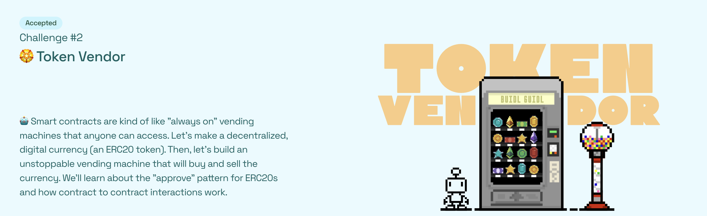
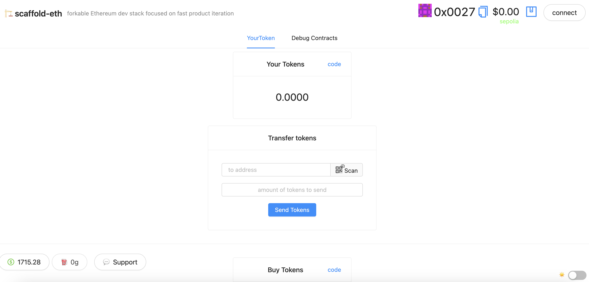

# 🏗 scaffold-eth | 🏰 BuidlGuidl

> 🤖 Smart contracts are kind of like "always on" *vending machines* that **anyone** can access. Let's make a decentralized, digital currency. Then, let's build an unstoppable vending machine that will buy and sell the currency. We'll learn about the "approve" pattern for ERC20s and how contract to contract interactions work.  

> 🏵 Create `YourToken.sol` smart contract that inherits the **ERC20** token standard from OpenZeppelin. Set your token to `_mint()` **1000** (\* 10 \*\* 18) tokens to the `msg.sender`. Then create a `Vendor.sol` contract that sells your token using a payable `buyTokens()` function.

> 🎛 Edit the frontend that invites the user to `<input\>` an amount of tokens they want to buy. We'll display a preview of the amount of ETH (or USD) it will cost with a confirm button.

> 🔍 It will be important to verify your token's source code in the block explorer after you deploy. Supporters will want to be sure that it has a fixed supply and you can't just mint more.

> 🌟 The final deliverable is an app that lets users purchase your ERC20 token, transfer it, and sell it back to the vendor. 

Vendor Contract
CODE: https://sepolia.etherscan.io/address/0xae15E5ab4171745267ED2B86718D6671f4ced739

DEMO: https://absorbed-celery.surge.sh/